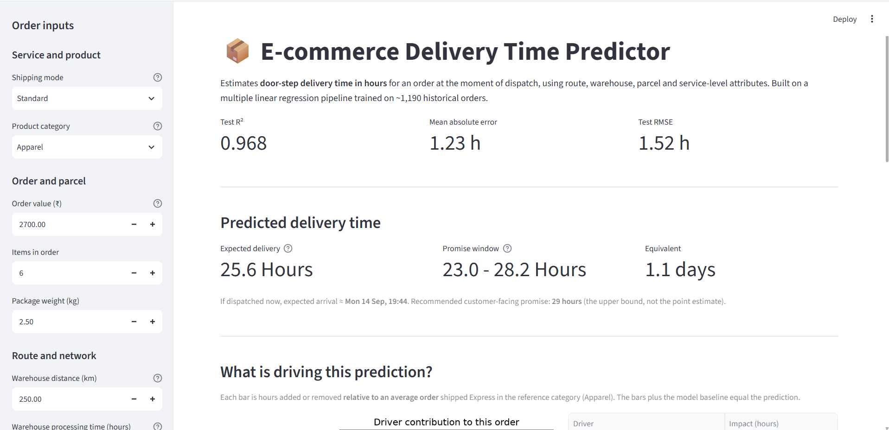
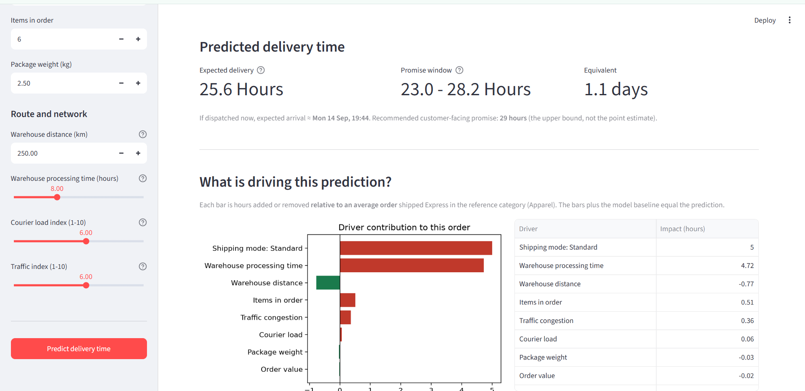
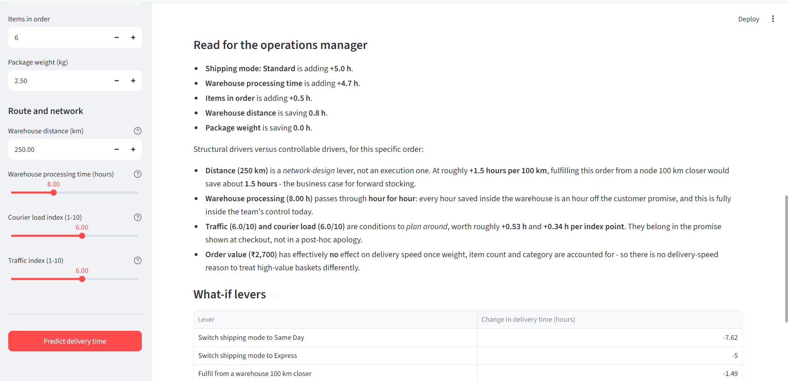
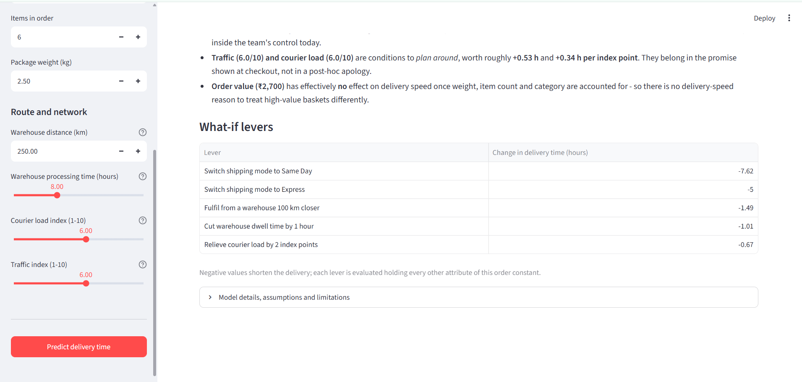
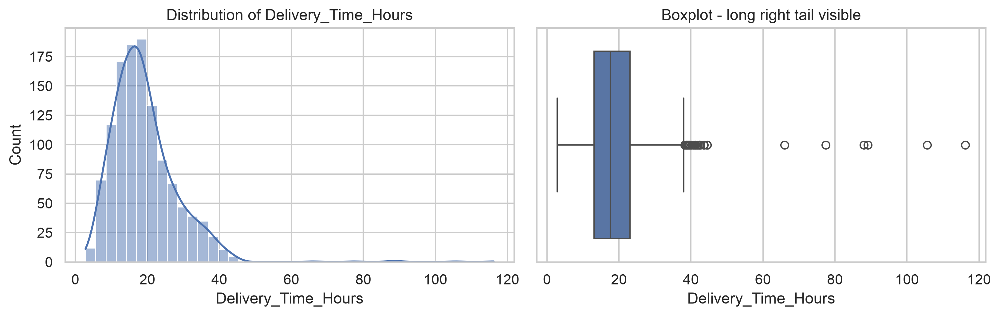
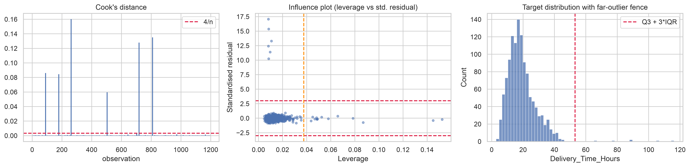
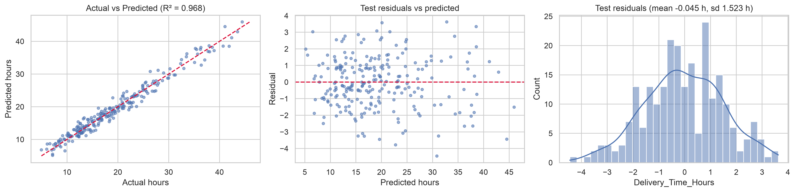

# Delivery Time Prediction — Assignment 2 (Dataset 8)

**Course:** AI Spreadsheets and Python Programming · **Assignment:** 2 — Model to Web Application
**Dataset:** 8 — E-commerce Delivery Time Prediction · **Domain:** Operations and E-commerce
**Target variable:** `Delivery_Time_Hours` (continuous, hours)
**Primary model:** Multiple Linear Regression inside a scikit-learn `Pipeline`

---

## 1. Business problem

An e-commerce operations team has to commit to a delivery window at the moment of checkout,
before anything has actually moved.

- **Promise too aggressively** and the company pays for expedited recovery, breaches SLAs,
  absorbs support contacts and loses repeat purchase.
- **Promise too conservatively** and it loses the conversion to a competitor showing a
  faster date on the same product.

Today that window is set from static zone tables that ignore live conditions: how long the
order will actually sit in the warehouse, how congested the lane is, how saturated the
courier is. The result is a promise that is simultaneously too vague to trust and too rigid
to be accurate.

**This project delivers two things:**

1. **A prediction:** expected door-step time in hours, from attributes known at dispatch —
   route distance, warehouse dwell time, courier saturation, road congestion, parcel profile,
   product category and service tier.
2. **A lever map:** which of those drivers actually moves delivery time, quantified in hours,
   so the team knows where an hour of improvement is cheapest to buy.

**Model performance (held-out test set, 239 orders):** R² **0.968**, Adjusted R² **0.966**,
MAE **1.23 hours**, RMSE **1.52 hours**. About **82%** of held-out orders landed within
±2 hours of the prediction and **94%** within ±3 hours.

---

## 2. Project structure

| File | Purpose |
|---|---|
| `generate_data.py` | Generates `data.csv` — 1,215 synthetic orders following the Dataset 8 column specification |
| `data.csv` | The generated dataset used for analysis and training |
| `model_training.ipynb` | Parts A–C: EDA, all assumption diagnostics and corrections, model training, evaluation, export |
| `model.pkl` | Saved preprocessing + `LinearRegression` pipeline (`joblib`) |
| `model_metadata.pkl` | Feature contract: column order, category levels, valid ranges, test metrics — read by the app |
| `data_cleaned.csv` | Post-cleaning dataset actually used for modelling (1,191 rows) |
| `app.py` | Streamlit prediction application (Part D) |
| `requirements.txt` | Pinned-by-minimum dependency list |
| `README.md` | This file |

> **Column names** follow the Dataset Specification document exactly (snake_case:
> `Order_ID`, `Order_Value`, `Package_Weight_Kg`, `Warehouse_Distance_Km`,
> `Courier_Load_Index`, `Traffic_Index`, …). The `Order_ID` identifier is dropped before
> modelling — it is a unique key with no predictive content.

---

## 3. Setup

Requires **Python 3.9+**.

```bash
# 1. Create and activate a virtual environment
python -m venv .venv

# macOS / Linux
source .venv/bin/activate
# Windows (PowerShell)
.venv\Scripts\Activate.ps1

# 2. Install dependencies
pip install -r requirements.txt
```

`requirements.txt`:

```
pandas>=1.5
numpy>=1.23
scikit-learn>=1.2
statsmodels>=0.13
matplotlib>=3.6
seaborn>=0.12
scipy>=1.9
joblib>=1.2
streamlit>=1.28
jupyter>=1.0
```

---

## 4. How to run

### Step 1 — Generate the dataset

```bash
python generate_data.py
```

Writes `data.csv` (1,215 rows × 11 columns). The generator builds the target from an explicit
linear structural equation plus Gaussian noise, and **deliberately injects realistic data
quality problems** — missing values, 15 duplicate rows, impossible values (negative weight
and distance, zero-item orders, an out-of-scale traffic index), inconsistent category
spellings (`electronics`, `APPAREL `, `Same Day`), and a handful of operational outliers — so
that Part A is a real exercise. Set `INJECT_DIRT = False` at the top of the script for a
clean file.

### Step 2 — Train the model

```bash
jupyter notebook model_training.ipynb   # then Run All
```

Runs top to bottom in well under a minute and produces `model.pkl`,
`model_metadata.pkl` and `data_cleaned.csv`.

> **Run this step even though `model.pkl` ships with the project.** Pickles are tied to the
> library versions that created them; regenerating locally guarantees `app.py` can load the
> artefact on your machine.

### Step 3 — Launch the web application

```bash
streamlit run app.py
```

Opens on `http://localhost:8501`. The app loads `model.pkl` once via
`@st.cache_resource` — it never re-trains, and it performs no preprocessing of its own
(scaling and encoding live inside the saved pipeline, which removes train/serve skew by
construction).

**What the app does**

- Input controls for all nine predictors: dropdowns for `Shipping_Mode` and
  `Product_Category`, number inputs for value / weight / distance / item count, sliders for
  processing hours, courier load and traffic index.
- **Validation** in two tiers: impossible inputs (non-positive value, weight or distance,
  zero items, out-of-range 1–10 indices) block the prediction with an explicit error;
  suspicious-but-possible inputs (same-day service on a 400 km lane, 8 items weighing 0.2 kg,
  values outside the trained envelope) produce a warning and flag the result as an
  extrapolation rather than failing silently.
- Prediction shown as **hours**, with a promise window that widens on longer lanes, an
  absolute ETA, and a recommended customer-facing figure.
- **Driver attribution**: a bar chart and table decomposing the prediction into hours added
  or saved by each feature relative to an average order (contributions plus the model
  baseline reproduce the prediction exactly).
- **What-if levers**: the hour impact of switching service tier, cutting warehouse dwell time
  by an hour, sourcing from a warehouse 100 km closer, or relieving courier load.

### Working application

The screenshots below are from a live run of `app.py` (Standard shipping, Apparel, ₹2,700
order, 250 km lane, 8 h warehouse dwell, courier load 6/10, traffic 6/10).

**1. Prediction result with promise window**

The app returns a point estimate of **25.6 hours** with a **23.0–28.2 hour** promise window
and an absolute ETA, alongside the headline test-set metrics (R² 0.968, MAE 1.23 h).
It also converts the estimate into a **29-hour customer-facing promise** (the upper bound,
not the point estimate), so the team never quotes a number it beats only half the time.

**2. Driver attribution chart**

A waterfall-style bar chart and table decompose the 25.6-hour prediction into each feature's
contribution relative to an average Express/Apparel order — Standard service (+5.0 h) and
warehouse processing (+4.72 h) dominate, while distance actually saves time for this order.
The bars plus the model baseline reproduce the prediction exactly, so the attribution is
audit-able rather than a black box.

**3. Plain-language read for the operations manager**

Below the chart, the same numbers are restated as bullet-point business language and split
into **structural** levers (distance, network design) versus **controllable** ones
(warehouse dwell time), so a non-technical manager can act on the model without reading
coefficients. It closes by confirming order value has no meaningful effect on speed.

**4. What-if levers table**

A what-if table quantifies the hours saved by five concrete interventions — e.g. switching
to Same-Day (−7.62 h) or cutting warehouse dwell time by an hour (−1.01 h) — each evaluated
holding every other attribute of this specific order constant. This turns the model into a
decision tool: operations can compare the cost of each lever against its hour payoff.

---

## 5. Part A — assumption diagnostics: what was found and what was done

| Assumption | Diagnostic | Finding | Action taken |
|---|---|---|---|
| Data quality | Null counts, duplicate scan, range rules, category value counts | 65 missing values, 15 exact duplicates, 19 impossible values, 10 category spellings for 6 real categories | Normalised category labels **before** encoding; dropped duplicates; impossible values → `NaN`; rows with unusable target dropped; predictors median-imputed |
| Linearity | Scatter + LOWESS, partial-residual plots | Straight across the full range for every continuous predictor | None needed — no transformation applied |
| Multicollinearity | Correlation matrix + VIF | Max pairwise r = 0.34 (traffic ↔ courier load); **all VIF ≈ 1.0–1.25** | None — no predictor dropped or combined |
| Independence of errors | Durbin-Watson | **2.05** (≈ ideal); rows are independent orders with no time key | None; noted that the production risk is *clustering* by warehouse-day, handled with robust/clustered SEs |
| Homoscedasticity | Residuals vs fitted, scale-location, Breusch-Pagan | Violated — error scale grows with journey length (BP p < 0.001 after influence treatment) | Log-target tested and **rejected** (BP still fails, R² drops to 0.92, coefficients lose their hour interpretation); adopted **HC3 robust standard errors** on the level model, and the app widens its promise window with distance |
| Normality of residuals | Histogram, Q-Q, Jarque-Bera, Shapiro-Wilk | Severe before treatment: skew ≈ 13, kurtosis ≈ 185 | Traced to 6 influential points, not to functional form; after their removal **JB p ≈ 0.87, skew ≈ 0.00** |
| Outliers / influence | Standardised residuals, leverage, Cook's D, IQR fence | 6 cases at 66–116 h with ordinary predictors and 5–20× median Cook's D; 14 high-leverage long-haul lanes | **Removed** the 6 unexplainable exception cases (customs holds, failed attempts — driven by variables the dataset does not contain); **retained** all high-leverage long-haul rows, which are legitimate repeat business |
| Categorical encoding | — | `Product_Category` (6 levels) and `Shipping_Mode` (3 levels) are nominal | `OneHotEncoder(drop='first')` inside the pipeline — no accidental ordinal ranking, no dummy trap |
| Re-check | All of the above re-run | R² 0.667 → **0.967**, normality and influence fixed, heteroscedasticity documented and treated | — |

The R² jump from 0.667 to 0.967 comes entirely from removing six exception rows — a clean
demonstration of how much a handful of influential observations can distort OLS.

---

## 6. Essential plots — dataset and model diagnostics

The figures below are the actual diagnostic output from `model_training.ipynb` (Parts A–C),
generated on `data_cleaned.csv` / the fitted pipeline, referenced by the Part A table above.

**1. Target distribution and boxplot**

`Delivery_Time_Hours` is right-skewed, piling up between 10–25 hours with a long tail out
past 100 hours. The boxplot isolates the handful of extreme cases (66–116 h) later confirmed
as the six unexplainable exception orders removed in Part A.

**2. Delivery time by product category and shipping mode**

Median delivery time barely moves across product categories (Groceries fastest, Electronics
slowest), but shipping mode separates the data cleanly — Same-Day clusters under 20 hours
while Standard stretches past 40, confirming service tier as a strong categorical driver.

**3. Scatter plots of each numeric predictor vs delivery time**

`Warehouse_Distance_Km` shows by far the strongest linear relationship (r = +0.69), while
`Order_Value`, `Package_Weight_Kg` and `Items_in_Order` show almost no raw correlation —
consistent with their small coefficients in the final model.

**4. Partial-residual plots (linearity check)**

The red LOWESS curve tracks the dashed fitted linear component closely for every continuous
predictor, with no curvature — the linearity assumption holds and no transformation
(log, polynomial) was needed for any feature.

**5. Correlation matrix among numerical predictors**

The highest pairwise correlation is +0.34 (Courier_Load_Index ↔ Traffic_Index); everything
else sits below +0.32. This low multicollinearity is what later produces VIF values of
roughly 1.0–1.25 across all predictors.

**6. Residual order and lag-1 scatter (independence check)**

Residuals in row order sit flat around zero with only two sharp spikes (the influential
exception cases); the lag-1 scatter shows no autocorrelation pattern, supporting the
Durbin-Watson result of 2.05 — errors are independent.

**7. Residuals vs fitted and scale-location (heteroscedasticity check)**

The scale-location panel's red trend line rises gently as fitted values increase, showing
error spread growing with journey length — the visual confirmation of the Breusch-Pagan
violation, which the app addresses by widening its promise window on longer lanes.

**8. Residual histogram and Q-Q plot before treatment**

Before removing influential points, residuals are heavily right-skewed with the Q-Q plot
bending sharply away from the diagonal at the top — a handful of extreme residuals (10–17)
distort normality far more than the model's typical error.

**9. Cook's distance, influence plot, and target far-outlier fence**

Six observations spike well above the 4/n Cook's distance threshold and sit far outside the
Q3 + 3×IQR fence on the target — these are the exact six exception cases dropped in Part A,
isolated here from the otherwise well-behaved high-leverage long-haul orders that were kept.

**10. Residual diagnostics after treatment**

After removing the six exception cases, residuals scatter evenly around zero (BP p still
< 0.001, confirming heteroscedasticity remains) but the Q-Q plot now hugs the diagonal and
the histogram is symmetric — Jarque-Bera p ≈ 0.869 confirms residual normality is restored.

**11. Standardised driver importance**

Ranking every driver by its per-1-SD effect makes `Warehouse_Distance_Km` and
`Shipping_Mode_Standard` the two largest levers on delivery time, with `Shipping_Mode_Same_Day`
the single largest time-saving effect — the same ranking underlying the app's driver chart.

**12. Actual vs predicted and test-residual distribution**

On the 239-order held-out test set, predicted hours track actual hours tightly around the
45° line (R² = 0.968); the residual histogram is centred near zero (mean −0.045 h,
sd 1.523 h) with no pattern left versus predicted values.

---

## 7. Key business takeaways (from the regression coefficients)

Standardised coefficients (hours per 1 standard deviation) answer *"which lever is worth
pulling?"*; per-unit coefficients answer *"what does one more unit cost me?"*

| Driver | Per 1 SD | Per unit | Read |
|---|---|---|---|
| `Warehouse_Distance_Km` | **+5.54 h** | +0.0149 h/km | ≈ **+1.5 h per 100 km** |
| `Shipping_Mode = Standard` | **+5.00 h** | vs Express | Service tier is worth ~7.6 h end to end |
| `Shipping_Mode = Same_Day` | **−2.62 h** | vs Express | |
| `Warehouse_Processing_Hours` | **+1.89 h** | **+1.01 h/hour** | Passes through **one for one** |
| `Product_Category = Electronics` | +1.81 h | vs Apparel | Serialisation / fragile handling |
| `Product_Category = Home_Kitchen` | +1.24 h | vs Apparel | Bulk handling |
| `Product_Category = Groceries` | −0.96 h | vs Apparel | Cold-chain lanes run fast by design |
| `Traffic_Index` | +0.95 h | +0.53 h/point | Moderate → severe congestion ≈ +2.1 h |
| `Courier_Load_Index` | +0.60 h | +0.34 h/point | ≈ 20 min per index point |
| `Items_in_Order` | +0.53 h | +0.24 h/item | Pick/pack friction |
| `Package_Weight_Kg` | +0.16 h | +0.04 h/kg | Small but real |
| `Order_Value` | +0.07 h | ≈ 0 | **Not significant** (robust p ≈ 0.06) |

### The four decisions this supports

1. **Warehouse dwell time is the cheapest hour to buy.** A coefficient of **1.01** is the
   cleanest finding in the model: every hour an order sits in the warehouse is an hour added
   to the customer's wait, with **zero absorption downstream**. Unlike distance or traffic it
   is entirely inside the team's control today — shave 90 minutes off average
   pick-pack-manifest time and every promise improves by 90 minutes. Start here.
2. **Distance is a network-design lever, and now it has a price.** At **+1.5 hours per
   100 km**, fulfilling from a node 300 km closer arrives ≈ **4.5 hours sooner, every single
   time**. That converts the forward-stocking / micro-fulfilment debate from an intuition
   into a per-lane hours-saved calculation, and it is also the argument for better
   warehouse-to-pincode sourcing rules on existing inventory.
3. **The service-tier price differential is justified — and so is the upgrade as a recovery
   tool.** Holding distance and everything else constant, Standard → Same-Day is worth
   **≈ 7.6 hours**. That is the real value of a free-upgrade gesture on an at-risk order, and
   it prices the give-away properly instead of guessing.
4. **Stop treating high-value orders as special for speed.** `Order_Value` has **no
   meaningful effect** once weight, item count and category are controlled for. There is no
   delivery-speed penalty to encouraging larger baskets, and no case for a value-based
   routing rule — the apparent link is entirely explained by what those orders physically
   contain.

Additionally: traffic and courier load add roughly **0.53 h** and **0.34 h per index point**.
Neither is controllable, but both are *forecastable* — they belong in the window shown at
checkout, not in a post-hoc apology. Congestion and courier saturation also give operations
an explicit delivery cost for under-staffing a route on a peak day.

---

## 8. Limitations

1. **The model predicts normal-course delivery.** The six exception cases removed in Part A
   are real events driven by variables the dataset does not contain (customs holds, failed
   first attempts, address disputes). A conditional-mean regression cannot learn them, so the
   model will under-predict an order that gets stuck. Exception risk needs its own
   classifier — "will this order jam?" — which is a separate problem from "how long will it
   normally take?".
2. **Error scale grows with journey length.** The point prediction is unbiased, but a single
   fixed ± tolerance is wrong. The app therefore widens its window on long lanes rather than
   quoting one constant band.
3. **Out-of-envelope inputs are extrapolation.** Same-day beyond ~60 km and express beyond
   ~900 km were not represented in training; the app flags these explicitly.
4. **Associations, not proven causation.** Coefficients come from observational data. The
   distance and dwell-time effects are large, mechanically sensible and robust enough to act
   on; the smaller category effects should be read as directional.
5. **Synthetic data.** `data.csv` is generated for this assignment, so the coefficients
   recover a known data-generating process. The pipeline, diagnostics and app transfer to a
   real feed unchanged; the specific numbers would need re-estimation.

---

## 9. Assignment deliverables checklist

- [x] Generated dataset — `data.csv` (1,215 rows, exact specification column names)
- [x] Notebook with assumption checks and corrections — `model_training.ipynb` (Parts A–C)
- [x] Saved model pipeline — `model.pkl` (+ `model_metadata.pkl` feature contract)
- [x] Working web application — `app.py` (Streamlit, Part D)
- [x] README with run instructions and screenshot slots — this file
